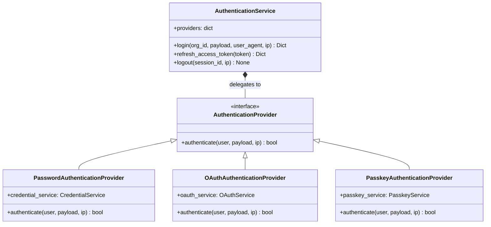
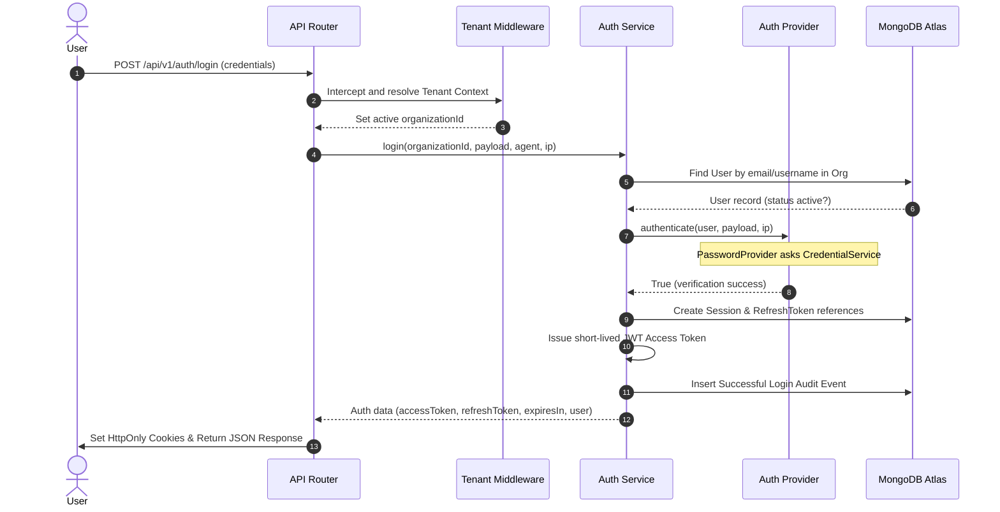
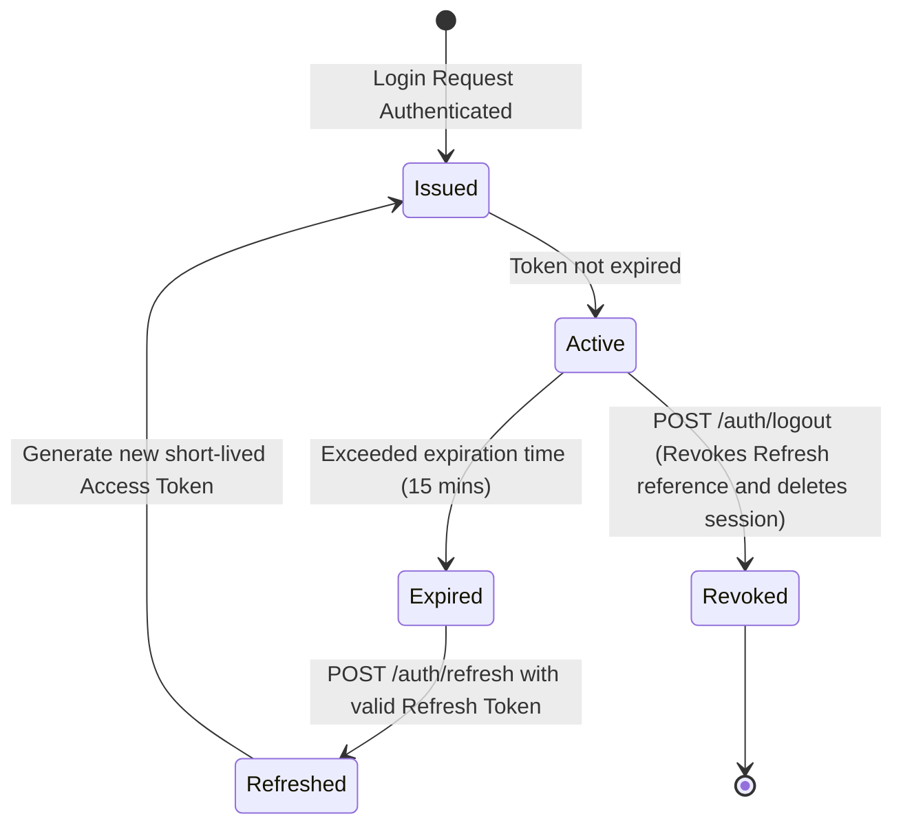

# Authentication Engine Documentation

This document describes the design, implementation, and future directions of the **CampusOS Authentication Engine**.

---

## 1. Architectural Strategy Pattern

Following the CTO Design Decisions, the Authentication Engine is decoupled from how users prove their identity. It implements the **Strategy Pattern** where the `AuthenticationService` delegates credentials verification to an pluggable `AuthenticationProvider`.



---

## 2. Authentication Sequence Diagram



---

## 3. JWT Claims & Lifecycle Diagram

### Access Token Claims Layout
The access token is short-lived (configured in platform settings, typically 15 minutes). It contains the following custom claims:
- `sub`: User ID
- `userId`: User ID
- `organizationId`: Scoped Organization ID
- `roles`: Scoped list of role slugs (e.g. `["student"]`)
- `permissions`: Minimal list of permission slugs (e.g. `["settings:read"]`)
- `sessionId`: Session reference ID
- `iat`: Timestamp issued at
- `exp`: Timestamp expires at
- `iss`: Issuer ("CampusOS")
- `aud`: Audience ("campusos-api")

### JWT Lifecycle



---

## 4. Future Integrations

Because of the Strategy pattern, future login methods plug seamlessly into the Authentication Engine.

### 4.1. Future Multi-Factor Authentication (MFA)
1. **Verification**: During password or OAuth verification, if `user.mfa_enabled` is `True`, instead of returning session tokens, return a partial authentication response:
   ```json
   {
     "success": true,
     "message": "MFA challenge required.",
     "data": {
       "mfaRequired": true,
       "mfaToken": "temporary_mfa_sign_token"
     }
   }
   ```
2. **Resolution**: The client submits the TOTP code to `/api/v1/auth/mfa/verify` along with the `mfaToken`. A `MFAAuthenticationProvider` validates the TOTP code, and upon success, triggers final session and JWT issuance.

### 4.2. Future OAuth Providers (Google, Microsoft)
1. Register a `GoogleAuthenticationProvider` inside the `AuthenticationService`.
2. The endpoint receives `provider = "google"` and `payload = {"idToken": "google_jwt_token"}`.
3. The provider verifies the Google ID token signature, extracts the user email, maps it to a user and org, and completes the login if verification succeeds.

### 4.3. Future Passkey (WebAuthn) Provider
1. Register a `PasskeyAuthenticationProvider`.
2. The login payload submits the WebAuthn assertion signature challenge.
3. The provider verifies the signature challenge against the public key stored in the user's passkey `Credential` document, completing authentication.
