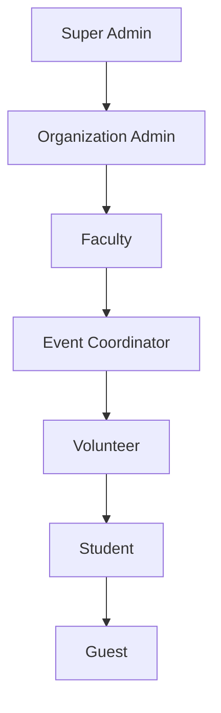
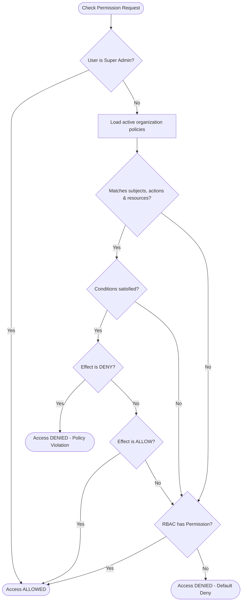

# Authorization Platform (RBAC + Policy Engine)

This document provides a technical specification and architecture guide for the **Authorization Platform** (Story 2.5) of CampusOS.

---

## 1. Role Hierarchy

CampusOS implements a linear role hierarchy where parent roles inherit permissions of all children roles. 



Inheritance is resolved at runtime by the `RoleResolver`:
- Given role `Faculty`, the user obtains the rights of `["faculty", "event-coordinator", "volunteer", "student", "guest"]`.

---

## 2. Policy Engine Flow

Policies act as an attribute-based restriction layer evaluated before RBAC checks. Policies support dynamic condition constraints like time window ranges and department scopes.



---

## 3. Permission Evaluation Order

The evaluation engine adheres to the following sequence:

1. **Super Admin Override**: Bypasses all rules and yields `ALLOW`.
2. **Explicit Deny**: If any matching policy has a `DENY` effect and satisfies conditions, access is immediately blocked.
3. **Explicit Allow**: If any matching policy has an `ALLOW` effect and satisfies conditions, access is granted.
4. **Role Inheritance (RBAC)**: Checks if the expanded user roles have the permission assigned (supporting wildcards).
5. **Default Deny**: Fallback block if no permissions match.

---

## 4. Permission Naming Guide

Permissions are formatted using `module.resource.action`:
- **Format**: `[module].[resource].[action]`
- **Examples**:
  - `events.event.create`
  - `attendance.record.scan`
  - `certificates.template.generate`

### Wildcards
Evaluating rules supports trailing wildcards:
- `events.*` grants access to all actions in the event module (e.g. `events.event.create`, `events.event.delete`).
- `*` represents administrative root control.

---

## 5. Extension Guide: Adding Attribute-Based Rules

To extend the system for future Attribute-Based Access Control (ABAC):
1. Add new attributes (e.g., location, browser type) to the `conditions` dictionary in the `Policy` document.
2. Update the condition parser in `PolicyEngine.evaluate_conditions` in [policy_engine.py](file:///e:/CampusOS/apps/api/app/core/policy_engine.py):
   ```python
   # Example: location check
   if "location" in policy.conditions:
       allowed_locs = policy.conditions["location"]
       user_loc = context_data.get("location")
       if user_loc not in allowed_locs:
           return False
   ```
3. Pass context data to the decorator or direct evaluator call.
