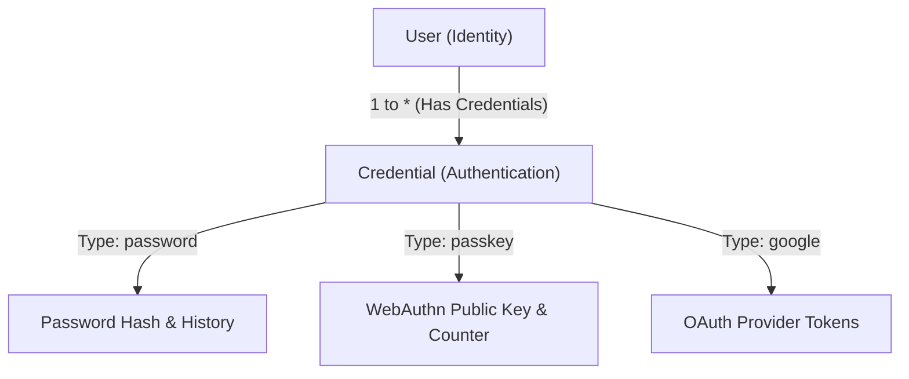
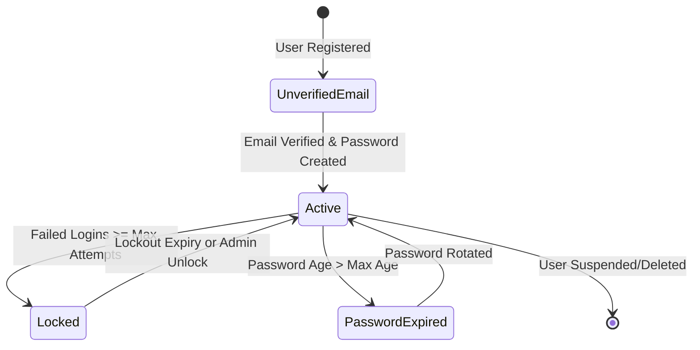
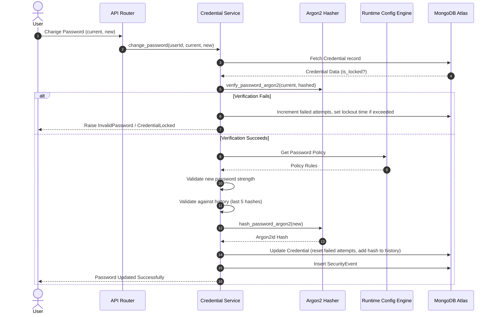

# Credential Management Engine Documentation

This document describes the design, implementation, and future directions of the **CampusOS Credential Management Engine**.

---

## 1. Architectural Overview

To support future authentication schemes (OAuth, Magic Links, Passkeys, etc.) without redesigning user identity, the credential layer is entirely decoupled from the core `User` document.

The `User` remains the single stable representation of user profile data and organizational affiliations, while the `Credential` represents the verification methods attached to that user.

---

## 2. Diagrams

### Credential Lifecycle Diagram

### Password Flow Diagram (Verification & Change)

---

## 3. Swagger Documentation & API Endpoints

All endpoints are mounted under `/api/v1/credentials`.

- **`POST /api/v1/credentials`**: Initialize credential (e.g. password) for a user after email verification.
- **`POST /api/v1/credentials/change-password`**: Updates user password requiring validation of the current password, complexity checks, and history checks.
- **`POST /api/v1/credentials/reset-password`**: Resets password using a one-time validation token hash lookup.
- **`POST /api/v1/credentials/force-reset`**: Admin action to force password reset, setting `requiresPasswordChange = true`.
- **`GET /api/v1/credentials/{userId}`**: Fetch credential metadata (lock status, attempts, passwordChangedAt) without exposing hashes.
- **`PATCH /api/v1/credentials/{userId}`**: Update administrative settings (isLocked, requiresPasswordChange).

---

## 4. Security Enforcement Details

1. **Argon2id Cryptography**: Standard bcrypt hashing is replaced with **Argon2id** (via `argon2-cffi`) for passwords. This guarantees protection against GPU-based brute-force attacks and timing attacks.
2. **Password History Ring**: Up to 5 historical hashes are preserved in `passwordHistory` on the `Credential` model. Every change/reset verifies the proposed password against all historical hashes to prevent reuse.
3. **Brute Force Lockout**: Failed attempts are tracked. After exceeding the threshold (e.g., 5 attempts), the account is locked for the configured lockout duration (e.g., 15 minutes). Lockout durations are dynamically evaluated in-memory using `lockedUntil` timestamps.
4. **Credential Audit Trail**: Actions (change, lock, reset) write to both the standard `audit_logs` and generate formal `SecurityEvent` database documents.

---

## 5. Future Integrations

### Future OAuth Integration
To integrate OAuth:
1. Create a `Credential` with `type` equal to the provider name (e.g., `google`, `microsoft`).
2. Store the external provider user ID in `metadata.provider_subject_id`.
3. Save active access/refresh OAuth tokens in `metadata.oauth_tokens` if necessary for background API requests.
4. During authentication, verify the provider's token signature and match `metadata.provider_subject_id` to resolve the `User`.

### Future WebAuthn / Passkeys Integration
To integrate Passkeys:
1. Create a `Credential` with `type = "passkey"`.
2. Store the passkey public key, credential ID, and counter in `metadata.webauthn`.
3. Verify signature challenges during login and increment the counter to prevent replay attacks.
