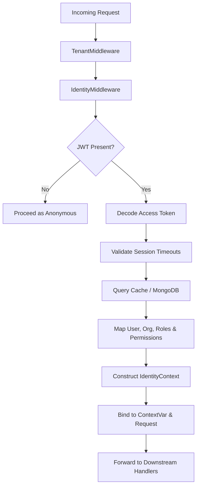
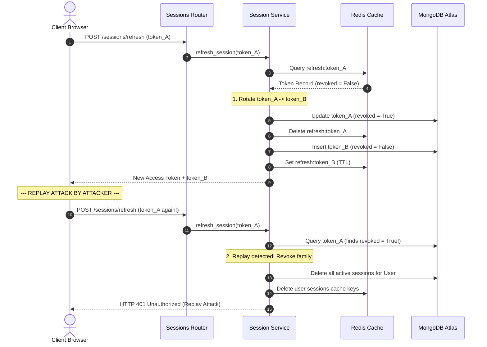

# Session & Device Management Engine

This document provides a technical specification of the **Session & Device Management Engine** built for CampusOS (Story 2.4).

---

## 1. Architecture Overview

The Session Engine acts as the central state-management authority for authenticated requests. While the Authentication Engine validates initial credentials, the Session Engine tracks active sessions, devices, rotation, and security contexts over time.



---

## 2. Identity Context Layout

Every authenticated request resolves to a consolidated `IdentityContext` made available via thread-safe ContextVars and FastAPI dependencies:

```python
class IdentityContext(BaseModel):
    user: User                     # Active Beanie User record
    organization: Organization     # Active Organization record
    active_roles: List[str]        # Slugs of user's active RBAC Roles
    active_session: Session        # Current active Session document
    device: Optional[Device]       # Recognized client Device profile
    permissions: List[str]         # Flat list of RBAC privilege slugs
    locale: str                    # Client browser locale preference
    timezone: str                  # Scoped organization timezone
    feature_flags: Dict[str, bool] # Active runtime flag definitions
```

---

## 3. Refresh Token Rotation (RTR) & Replay Prevention

Refresh Token Rotation ensures refresh keys can only be used once. If a compromised/rotated refresh token is re-sent, a replay attack is detected and the system instantly revokes the entire session family.



---

## 4. Timeout Policies

### 4.1. Absolute Timeout
Configured via `security.sessions.absolute_timeout_minutes` (default 7 days). Exceeding this window triggers immediate session deletion regardless of user activity.

### 4.2. Idle Timeout
Configured via `security.sessions.idle_timeout_minutes` (default 30 minutes). Every request updates `last_activity`. If the duration between requests exceeds this value, the session is invalidated.
