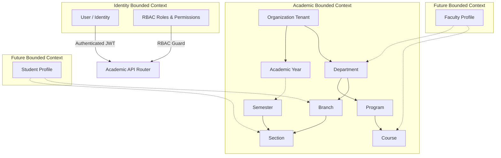

# Academic Structure Engine Bounded Context

## Context Map & Domain Boundaries

The Academic Platform is the foundation of the institutional hierarchy of CampusOS. It isolates all academic administrative metadata within a clean Bounded Context.



---

## Entity Relationship Flow

The relationship flows define how academic entities reference one another under multi-tenant organization isolation:

```
[Organization Tenant]
   ├── [Academic Year] (Has startDate, endDate, current flag)
   │      └── [Semester] (Optionally linked to Academic Year; ordered sequentially)
   │             └── [Section] (Associated with a branch and semester)
   │
   ├── [Department] (Identified by unique uppercase code e.g., "CSE")
   │      ├── [Program] (Degree/Level e.g., "B.Tech" with duration)
   │      │      └── [Course] (Holds credits, semester ref, name e.g., "CS101")
   │      │
   │      └── [Branch] (Specialization e.g., "AI & Machine Learning")
   │             └── [Section] (Associated with a branch and semester)
```

---

## Security Model & Permission Mapping

All write operations on academic resources require specific RBAC privileges:

| Target Resource | HTTP Method | Endpoint | Required Permission | Audit Action |
| :--- | :--- | :--- | :--- | :--- |
| **Academic Years** | `POST` | `/organizations/{org}/academic-years` | `academic:write` | `academic_year.created` |
| | `PATCH` | `/organizations/{org}/academic-years/{id}` | `academic:write` | `academic_year.updated` |
| | `DELETE` | `/organizations/{org}/academic-years/{id}` | `academic:delete` | `academic_year.deleted` |
| | `POST` | `/organizations/{org}/academic-years/bulk` | `academic:write` | `academic_year.bulk_created` |
| **Departments** | `POST` | `/organizations/{org}/departments` | `department:write` | `department.created` |
| | `PATCH` | `/organizations/{org}/departments/{id}` | `department:write` | `department.updated` |
| | `DELETE` | `/organizations/{org}/departments/{id}` | `department:delete` | `department.deleted` |
| **Programs** | `POST` | `/organizations/{org}/programs` | `academic:write` | `program.created` |
| | `PATCH` | `/organizations/{org}/programs/{id}` | `academic:write` | `program.updated` |
| | `DELETE` | `/organizations/{org}/programs/{id}` | `academic:write` | `program.deleted` |
| **Branches** | `POST` | `/organizations/{org}/branches` | `academic:write` | `branch.created` |
| | `PATCH` | `/organizations/{org}/branches/{id}` | `academic:write` | `branch.updated` |
| | `DELETE` | `/organizations/{org}/branches/{id}` | `academic:write` | `branch.deleted` |
| **Semesters** | `POST` | `/organizations/{org}/semesters` | `academic:write` | `semester.created` |
| | `PATCH` | `/organizations/{org}/semesters/{id}` | `academic:write` | `semester.updated` |
| | `DELETE` | `/organizations/{org}/semesters/{id}` | `academic:delete` | `semester.deleted` |
| **Sections** | `POST` | `/organizations/{org}/sections` | `academic:write` | `section.created` |
| | `PATCH` | `/organizations/{org}/sections/{id}` | `academic:write` | `section.updated` |
| | `DELETE` | `/organizations/{org}/sections/{id}` | `academic:write` | `section.deleted` |
| **Courses** | `POST` | `/organizations/{org}/courses` | `academic:write` | `course.created` |
| | `PATCH` | `/organizations/{org}/courses/{id}` | `academic:write` | `course.updated` |
| | `DELETE` | `/organizations/{org}/courses/{id}` | `academic:write` | `course.deleted` |

---

## Future Integration Contracts

### 1. Student Bounded Context
When student profiles are introduced in future sprints, they will link to the Academic Bounded Context using the following schema fields:
- `departmentId: PydanticObjectId` (Foreign key to `departments`)
- `programId: PydanticObjectId` (Foreign key to `programs`)
- `branchId: PydanticObjectId` (Foreign key to `branches`)
- `semesterId: PydanticObjectId` (Foreign key to `semesters`)
- `sectionId: PydanticObjectId` (Foreign key to `sections`)

The Student Platform will query the `AcademicService` to retrieve metadata matching these IDs:
```python
# Resolving student's academic section metadata
section = await academic_service.get_section(org_id, student.section_id)
```

### 2. Faculty Bounded Context
Faculty profiles will link to the academic structure for department affiliation and course assignments:
- `departmentId: PydanticObjectId` (Affiliation)
- `assignedCourses: List[PydanticObjectId]` (List of foreign keys to `courses`)
- `classTeacherOf: Optional[PydanticObjectId]` (Foreign key to `sections`)
